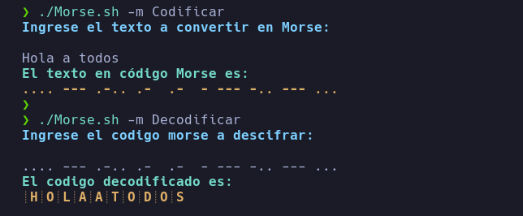

# Descripción
**Un pequeño codificador y decodificador de codigo Morse**
**Escrito en bash, para usar con amigos o usarlo de guía para transformarlo a otro lenguaje**
## Instalación 

```
git clone https://github.com/CyberDemonWH19/Codigo-Morse.sh.git
chmod 770 *
```
### Uso:
**Solamente ejecutar**

*Para codificar*
```
./Morse.sh -m Codificar
```
*Para decodificar*
```
./Morse.sh -m Decodificar 

```



**Que se diviertan**